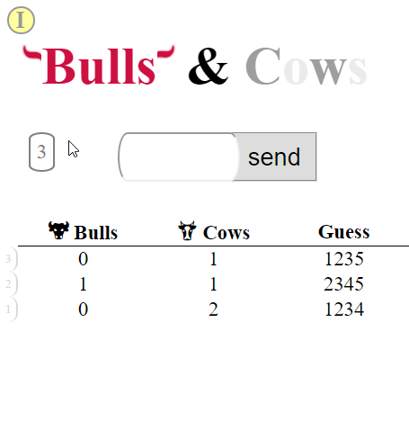

CowsNBulls
==========

Pure js _Cows And Bulls_ game

try to use simple (aka native) code as I can for the implemntion

#### [Rules from Wikipedia](https://en.wikipedia.org/wiki/Bulls_and_Cows)
-------------------------
The numerical version of the game played with 4 digits.    
On a sheet of paper, the players each write a 4-digit secret number.  
__The digits must be all different__.  
Then, in turn, the player try to guess their opponent's number who gives the number of matches.  
If the matching digits are in their right positions, they are "bulls", if in different positions, they are "cows".

Example:  

Secret number: 4271  
Opponent's try: 1234  
Answer: 1 bull and 2 cows. (The bull is "2", the cows are "4" and "1".)  

preview
-------

